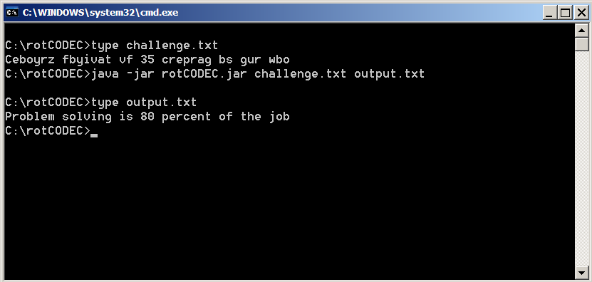
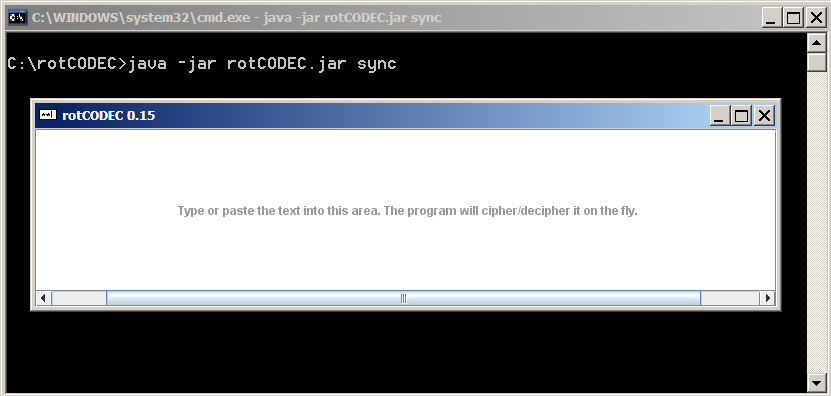

rotCODEC 0.15
=============

A no-frills program to encode/decode a given piece of text using the 
ROT 13/5 cipher. See [this Wikipedia article](http://en.wikipedia.org/wiki/ROT13) 
for more information on ROT13 and ROT5.

Features
--------

The program has two modes of operation: **asynchronous** (command line interface) and 
**synchronous** (graphical interface). The latter supports:
- Pasting from the clipboard.
- Encoding/decoding as text is typed/pasted.   

Minimum requirements
--------------------

Java SE Runtime Environment. If not already installed, you can download it from [Oracle](http://java.com/en/download/index.jsp). 
The application was developed with version 7 but may work with other versions.

Launching from the command line
-------------------------------

Syntax: `rotCODEC [list_of_files | sync]`

#### Examples

`java -jar rotCODEC.jar challenge.txt output.txt`

Enters the so-called **asynchronous mode**: takes the text in 
`challenge.txt`, applies the ROT13/5 cipher and saves the 
result into `output.txt`.

`java -jar rotCODEC.jar sync`

Enters **synchronous mode**: launches a text box into which the user can enter
the message to be ciphered or deciphered.

`java -jar rotCODEC.jar`

Same as above.

Launching from the desktop
--------------------------

Double clicking on the `rotCODEC.jar` file will, on most systems, launch the
graphical interface. 

Feedback
--------

If you have any comments or suggestions, please feel free to leave a message on 
my [website](http://www.hqcasanova.com). Thank you.